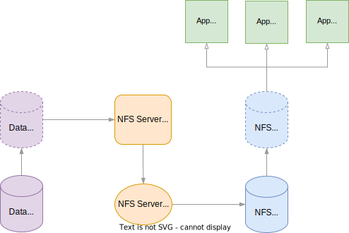

# CSI NFS Export Driver (EXPERIMENTAL)

> **Note:**
> This repo is in PoC stage

## Overview

1. This goal is to provide a "per-volume" `NFS export` for `PersistentVolumes`, both dynamically and statically.

1. Use an NFS-Ganesha `Pod` to export NFS

1. Use `ClusterIP` to mount NFS

1. Use CSI NFS Mounter instead of intree NFS volume

## Data Flow



## Highlights

1. Support Static Provisioning
2. Bind mount the local path on the data node
3. Implement controller.kubernetes.io/pod-deletion-cost
4. Delete NFS Pod and NFS SVC when NFS PVC is completely umounted
5. Implement NFS Clients Filter for NFS security (Ganesha only)

## How to deploy

```Console
$ kubectl apply -f deploy/

$ kubectl get pod -l nfs-export.csi.k8s.io/server
NAME                                        READY   STATUS    RESTARTS   AGE
csi-nfs-export-controller-79f987457-t8rzt   3/3     Running   0          16m
csi-nfs-export-node-5h5cj                   3/3     Running   0          16m
csi-nfs-export-node-mgldw                   3/3     Running   0          16m
csi-nfs-export-node-272q7                   3/3     Running   0          16m
```

## How to Use

### Create StorageClass

By default, the `default storage` class with be used as `DataStorageClass`, here we use Rancher's `local-path-provisioner` as an example.

```Console
$ $ kubectl annotate sc local-path storageclass.kubernetes.io/is-default-class=true
storageclass.storage.k8s.io/local-path annotated

$ kubectl get sc local-path
NAME                   PROVISIONER              RECLAIMPOLICY   VOLUMEBINDINGMODE      ALLOWVOLUMEEXPANSION   AGE
local-path (default)   rancher.io/local-path    Delete          WaitForFirstConsumer   false                  5d20h

$ kubectl apply -f example/storageclass.yaml

$ kubectl get sc nfs-export-csi
NAME             PROVISIONER             RECLAIMPOLICY   VOLUMEBINDINGMODE   ALLOWVOLUMEEXPANSION   AGE
nfs-export-csi   nfs-export.csi.k8s.io   Delete          Immediate           false                  38s
```

### Create PVC

A `DataPVC` names `nfs-<uuid>` will be created together with the `PVC`.

```Console
$ kubectl apply -f example/pvc-dynamic.yaml

$ kubectl get pvc
NAME                                       STATUS    VOLUME                                     CAPACITY   ACCESS MODES   STORAGECLASS      AGE
pvc-nfs-export-dynamic                     Bound     pvc-8474696b-1a51-4e9b-ab54-105f5ce2cb10   1Gi        RWX            nfs-export-csi    5s                                                                       piraeus-local-dflt-r2   12s
nfs-8474696b-1a51-4e9b-ab54-105f5ce2cb10   Pending                                                                        local-path        3s
```

### Attach and Mount PV

An 'NFSPod' and an 'NFSService', both named `nfs-<uuid>`, will be created to export NFS.

```Console
$ kubectl apply -f example/deployment-dynamic.yaml

$ kubectl get pod
NAME                                         READY   STATUS    RESTARTS   AGE
nfs-6c7cb3fe-385a-4f31-9dfb-b52bfb0f1702-0   1/1     Running   0          5m16s
deployment-nginx-dynamic-7d6cf76c6f-tcrrd    1/1     Running   0          5m17s
deployment-nginx-dynamic-7d6cf76c6f-nbdbh    1/1     Running   0          5m17s
deployment-nginx-dynamic-7d6cf76c6f-hr9xj    1/1     Running   0          5m17s

$ kubectl get svc
NAME                                       TYPE        CLUSTER-IP      EXTERNAL-IP   PORT(S)                    AGE
nfs-6c7cb3fe-385a-4f31-9dfb-b52bfb0f1702   ClusterIP   10.152.183.11   <none>        2049/TCP,111/TCP,111/UDP   2m42s
```
